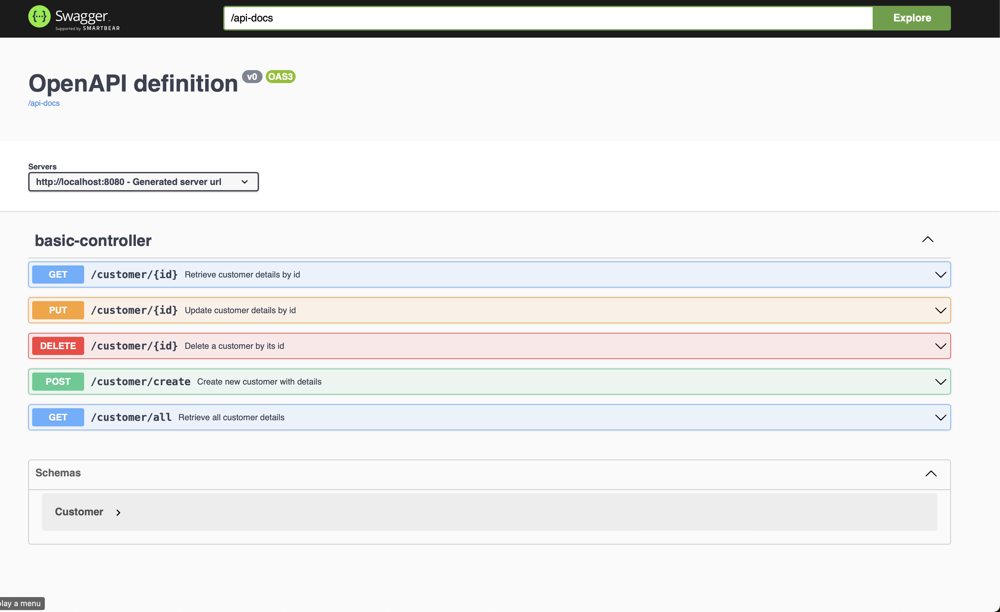

# Spring Boot containerized demo project

This is a sample Java / Maven / MySql (8.3.0) / Spring Boot (version 3.0.0) application deployed using docker. 


## About the application

The service is just a simple customer data REST service. It uses a MySql database to store the data. The customer data structure is in minimal with:
- `id` in BIGINT (20): the unique identifier of each customer record,
- `name` in varchar(255): the name of the customer
- `descriptions` in varchar(255): the descriptions regarding to the customer

This applications include CRUD (Create, Read, Update, Delete) and a "retrieve all" REST operations to manipulate the customer data.

This application demonstrates:

* Integrating latest **Spring** Framework: inversion of control, dependency injection, etc.
* Packaging as a Jar with embedded container (tomcat 8) in docker images, along with necessary tools such as MySql.
* Writing a RESTful service using annotation and support JSON request / response.
* Exception mapping from application exceptions to the right HTTP response with exception details in the body
* *Spring Data* Integration with JPA/Hibernate using configuration and annotations.
* Automatic CRUD functionality against the data source using Spring *Repository* pattern
* APIs are "documented" by Swagger2 using annotations


## How to Run

This application is packaged as a Jar which has Tomcat 8 embedded. No Tomcat or JBoss installation is necessary. 
User can run it using ```docker compose up``` command, on a PC / Mac / Linux with Docker installed.

### Steps
* Clone this repository by git clone or download to a folder.
* Make sure you have Docker installed.
* Navigate to the root directory of the repository. 
* Open a bash terminal and build the images by ```docker compose up ``` command.
* Once the application runs you should see something like this:

```
csmaster-docker-api_service-1  | 2024-02-10T08:38:31.574Z  INFO 1 --- [           main] o.s.b.w.embedded.tomcat.TomcatWebServer  : Tomcat started on port(s): 8080 (http) with context path ''
csmaster-docker-api_service-1  | 2024-02-10T08:38:31.635Z  INFO 1 --- [           main] c.example.csmaster.CsmasterApplication   : Started CsmasterApplication in 15.467 seconds (process running for 16.695)
```

## How to use the services

### To view Swagger 2 API docs

Once the server is started, the swagger UI will be available at http://localhost:8080/swagger-ui.html



### Use Postman or CLI
On the other hand, you can also use Postman or similar REST test tools, or `curl` to test with the APIs.

Examples of API end points are listed below:
### Retrieve customer by customer ID
```bash
curl -X 'GET' \
  'http://localhost:8080/customer/1' \
  -H 'accept: application/json'
```

### Update customer by customer ID
```bash
curl -X 'PUT' \
  'http://localhost:8080/customer/1' \
  -H 'accept: application/json' \
  -H 'Content-Type: application/json' \
  -d '{
  "descriptions": "Looking for special discount",
  "name": "Jack"
}'
```

### Retrieve all customer details
```bash
curl -X 'GET' \
  'http://localhost:8080/customer/all' \
  -H 'accept: */*'
```

### Create new customers
```bash
curl -X 'POST' \
  'http://localhost:8080/customer/create' \
  -H 'accept: application/json' \
  -H 'Content-Type: application/json' \
  -d '{
  "descriptions": "New joiners",
  "name": "Philip Jones"
}'
```

### Delete customer by Id
```bash
curl -X 'DELETE' \
  'http://localhost:8080/customer/3' \
  -H 'accept: */*'
```

# Redesign the application to deploy to GCP using native cloud

1. Using Maven App Engine Plugin to rebuild and redeploy the web application to Platform-as-a-Service (PaaS) serverless platform like Google App Engine
2. Using Google App Engine, the REST services can be deployed in very cost-effective manner, automatic Scaling allows service to scale up and scale down according to the traffic.
3. Replace MySql by cloud-based solution, like Google Cloud Datastore. By adding "GCP Datastore Starter" as dependency in `pom.xml`, maven will import libraries from GCP, and enable web application to use Google Cloud Datastore as repository, as if it is using databases solution. Comparing with maintaining database ourself, using cloud-based datastore also improve data resiliency, and facilitate multiple REST services to share and update unified datasource. 
4. The deployed web applications are located in virtual network environment accessible by known VPCs via Cloud Endpoints, but not necessarily accessible to public internet.


# Further improvement

When more time is given, we can improve the applications with:
1. Introduce monitoring and logging tools to the web applications
2. Modify API endpoints to support GraphQL, to enable more fine-grained and flexible data access
3. Improve the design so that user can update customer record with both semi-structured and unstructured data, such as data in JSON format and BLOB.